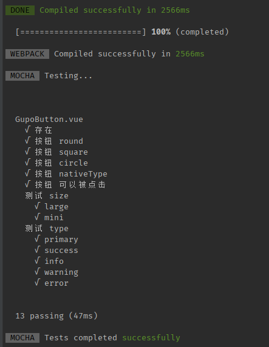

# 开始

## 介绍

是基于 Vue 的 UI 组件库，主要用于大家的积累和展示。

## 特性

- 🥳开箱即用的高质量 Vue 组件。
- ⚙️100+ 高质量组件
- 👹有丰富的单元测试，每个组件都经过严格的测试
- 🌵自说明的代码，即使没有注释，你也能看懂

## 安装
### npm 安装
推荐使用 npm 的方式安装，它能更好地和 [webpack](https://webpack.js.org/) 打包工具配合使用。
```
npm i gulu-front-components -S
// or yarn
yarn add gulu-front-components
```

## 使用说明

1. 首先在 src 中增加组件
2. 增加页面，直接在 docs/ 下增加 README.md 文件即可创建，🌰：/docs/components/basic/button/README.md
3. 增加路由，在 .vuepress/config.js 中 修改/新增 sidebar 属性即可，

   🌰1：
   ```
   { title: '开始', path: '/components/introduce/' }
   ```
   🌰2（嵌套路由）：
   ```
   {
    title: '通用',
    collapsable: false,
    children: [
        { title: 'Button 按钮', path: '/components/basic/button/' },
    ]
   }
   ```
4. done

### 替代 markdown 内容

> 由于用 markdown 写页面非常麻烦，所以我们采用在 `markdown` 中引入 `.vue` 文件的方式来写页面
> 
> 🌰：在 docs/vuepress/components 下增加 `.vue` 文件
> 
> 之后在 markdown 引入即可，如下，需要用 `ClientOnly` 包裹组件，组件名称为 **文件的路径**


```
<ClientOnly>
  <basic-button-index></basic-button-index>
</ClientOnly>
```

## 单元测试

> 每个组件都应经过严格的单元测试才能发布
> 
> 在 tests/unit/** 中
> 
> 运行 `yarn test:unit` 查看单测结果



## 发布

```
yarn deploy
// or
npm run deploy
```